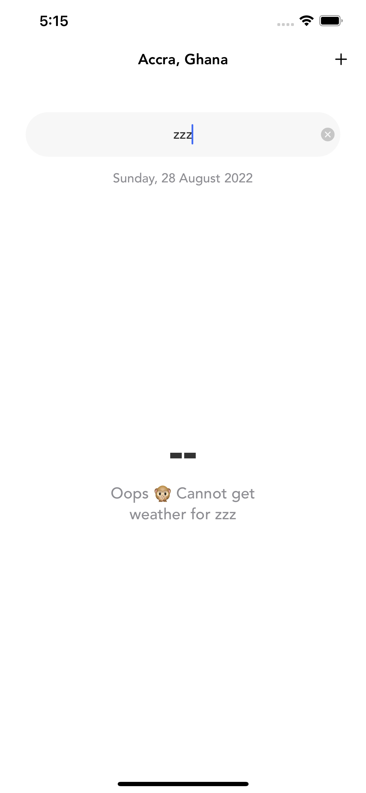
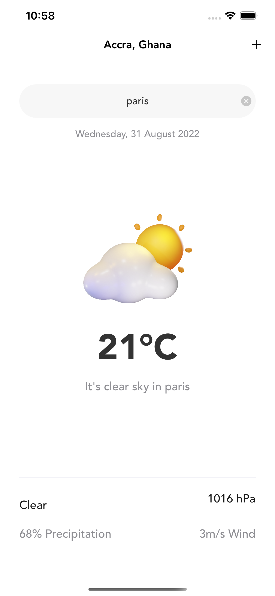
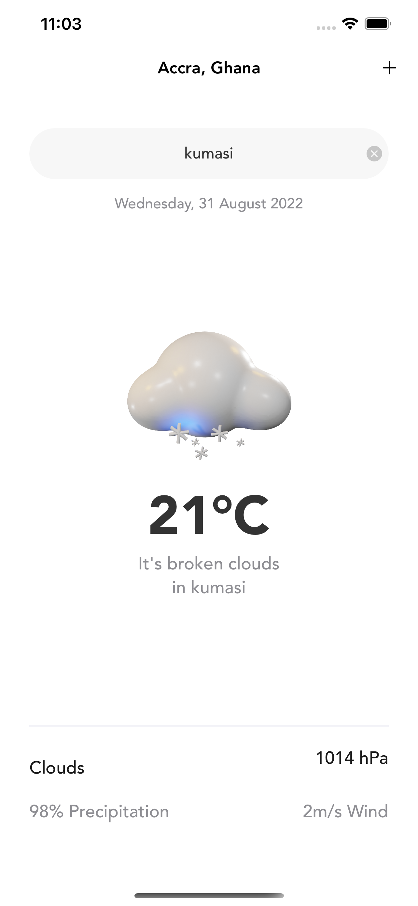
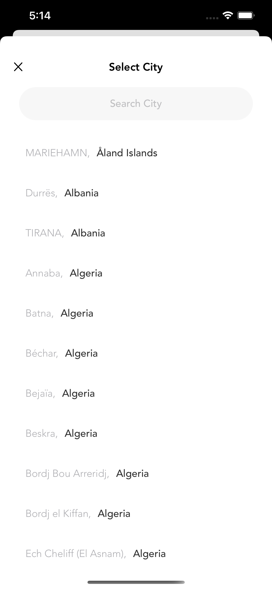
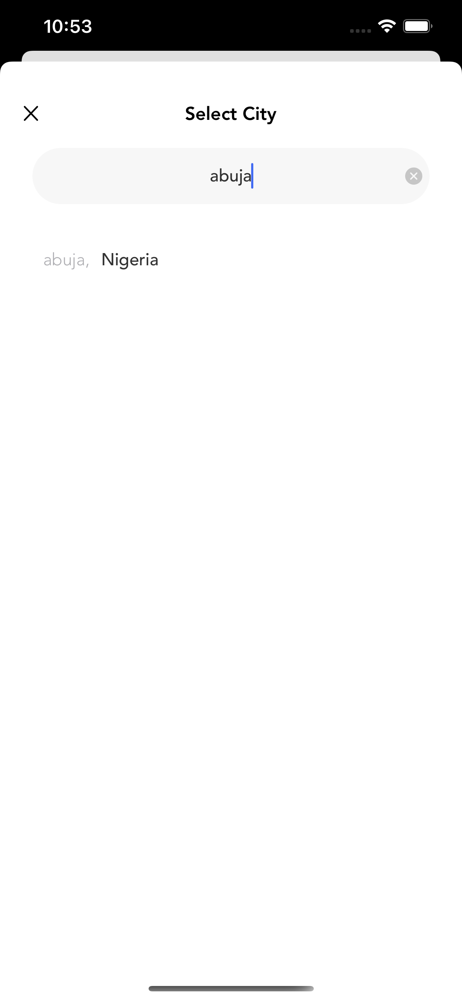

# Weather-App
A weather app using Combine to generate weather conditions of any location or city.

### Note ⚙️
The application was built using: 
* Xcode 12.5.1
* Swift 5.4
* macOS Big Sur 11.5.2

### Core Technologies 📲
* Swift
* Programmatic UI
* Combine

### Functionality
* Selecting city through list of cities.
* Search for weather based on your city

# Screenshots

Cheers 🍿
